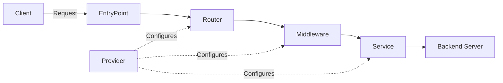

# Core Concepts

Understanding Traefik's architecture is key to using it effectively. This guide explains the fundamental building blocks and how they work together.

## Architecture Overview

Traefik's architecture is built around five core concepts that work together to route and handle requests:



<CardGroup cols={2}>
  <Card title="EntryPoints" icon="door-open">
    Network entry points that listen for incoming traffic on specific ports
  </Card>
  <Card title="Routers" icon="route">
    Analyze requests and connect them to services based on rules
  </Card>
  <Card title="Services" icon="server">
    Define how to reach the actual backend servers
  </Card>
  <Card title="Middleware" icon="filter">
    Transform requests and responses (auth, headers, rate limiting)
  </Card>
  <Card title="Providers" icon="plug">
    Discover and configure services automatically from infrastructure
  </Card>
</CardGroup>

## EntryPoints

EntryPoints are the **network entry points** into Traefik. They define the port which will receive packets, and whether to listen for TCP or UDP.

### How EntryPoints Work

Think of EntryPoints as the doors to your application. Each door (EntryPoint) listens on a specific port and protocol:

- `web` → Port 80 (HTTP)
- `websecure` → Port 443 (HTTPS)
- `custom` → Any port you define

### Configuration Examples

<CodeGroup>
```yaml YAML
entryPoints:
  web:
    address: ":80"
  websecure:
    address: ":443"
```

```toml TOML
[entryPoints]
  [entryPoints.web]
    address = ":80"
  [entryPoints.websecure]
    address = ":443"
```

```bash CLI
--entryPoints.web.address=:80
--entryPoints.websecure.address=:443
```
</CodeGroup>

<Tip>
  You can define multiple EntryPoints for different purposes: HTTP, HTTPS, database traffic, metrics endpoints, etc.
</Tip>

### Advanced EntryPoint Features

**UDP Support**: For protocols like DNS or game servers
```yaml
entryPoints:
  dns:
    address: ":53/udp"
```

**HTTP to HTTPS Redirect**:
```yaml
entryPoints:
  web:
    address: ":80"
    http:
      redirections:
        entryPoint:
          to: websecure
          scheme: https
  websecure:
    address: ":443"
```

## Routers

Routers are responsible for **connecting incoming requests to the services** that can handle them. They analyze requests using rules and forward them to the appropriate service.

### Router Rules

Routers use rules to determine if they should handle a request. Rules can match on:

- **Host**: `Host(`example.com`)`
- **Path**: `Path(`/api`)`
- **PathPrefix**: `PathPrefix(`/admin`)`
- **Headers**: `Headers(`Content-Type`, `application/json`)`
- **Method**: `Method(`GET`, `POST`)`

Rules can be combined using `&&` (AND) and `||` (OR):

```yaml
rule: "Host(`example.com`) && PathPrefix(`/api`)"
```

### HTTP Router Example

<CodeGroup>
```yaml YAML
http:
  routers:
    api-router:
      rule: "Host(`api.example.com`) && PathPrefix(`/v1`)"
      service: api-service
      entryPoints:
        - websecure
      middlewares:
        - auth
```

```toml TOML
[http.routers]
  [http.routers.api-router]
    rule = "Host(`api.example.com`) && PathPrefix(`/v1`)"
    service = "api-service"
    entryPoints = ["websecure"]
    middlewares = ["auth"]
```
</CodeGroup>

### Docker Labels Example

With Docker, routers are defined using labels:

```yaml
services:
  api:
    image: myapi:latest
    labels:
      - "traefik.enable=true"
      - "traefik.http.routers.api.rule=Host(`api.example.com`)"
      - "traefik.http.routers.api.entrypoints=websecure"
      - "traefik.http.routers.api.tls=true"
```

<Note>
  If no entrypoints are specified, the router will accept requests from all defined entrypoints.
</Note>

## Services

Services define **how to reach the actual backend servers** that will handle the requests. They configure load balancing, health checks, and server addresses.

### Load Balancer Configuration

Each service has a load balancer that can distribute traffic across multiple servers:

<CodeGroup>
```yaml YAML
http:
  services:
    my-service:
      loadBalancer:
        servers:
          - url: "http://192.168.1.10:8080"
          - url: "http://192.168.1.11:8080"
          - url: "http://192.168.1.12:8080"
```

```toml TOML
[http.services]
  [http.services.my-service.loadBalancer]
    [[http.services.my-service.loadBalancer.servers]]
      url = "http://192.168.1.10:8080"
    [[http.services.my-service.loadBalancer.servers]]
      url = "http://192.168.1.11:8080"
    [[http.services.my-service.loadBalancer.servers]]
      url = "http://192.168.1.12:8080"
```
</CodeGroup>

### Load Balancing Algorithms

Traefik supports multiple load balancing strategies:

- **Round Robin** (default): Distributes requests evenly
- **Weighted Round Robin**: Based on server weights
- **Least Connections**: Routes to server with fewest active connections

### Health Checks

Configure health checks to ensure traffic only goes to healthy servers:

```yaml
http:
  services:
    my-service:
      loadBalancer:
        healthCheck:
          path: /health
          interval: 10s
          timeout: 3s
        servers:
          - url: "http://192.168.1.10:8080"
```

<Tip>
  With provider-based configuration (Docker, Kubernetes), services are often created automatically from your infrastructure.
</Tip>

## Middleware

Middleware are **transformers** that can modify requests before they reach the service, or modify responses before they return to the client.

### Common Middleware Types

<CardGroup cols={2}>
  <Card title="Authentication">
    BasicAuth, DigestAuth, ForwardAuth for securing routes
  </Card>
  <Card title="Rate Limiting">
    Protect your services from abuse and control traffic
  </Card>
  <Card title="Headers">
    Add, modify, or remove HTTP headers
  </Card>
  <Card title="Path Manipulation">
    StripPrefix, AddPrefix, ReplacePath for URL rewriting
  </Card>
  <Card title="Retry">
    Automatically retry failed requests
  </Card>
  <Card title="Circuit Breaker">
    Prevent cascading failures in microservices
  </Card>
  <Card title="Compression">
    Compress responses to reduce bandwidth
  </Card>
  <Card title="Redirects">
    Redirect requests based on rules
  </Card>
</CardGroup>

### Middleware Examples

<CodeGroup>
```yaml Basic Auth
http:
  middlewares:
    auth:
      basicAuth:
        users:
          - "admin:$apr1$H6uskkkW$IgXLP6ewTrSuBkTrqE8wj/"
```

```yaml Rate Limiting
http:
  middlewares:
    rate-limit:
      rateLimit:
        average: 100
        burst: 50
```

```yaml Add Headers
http:
  middlewares:
    security-headers:
      headers:
        customResponseHeaders:
          X-Custom-Header: "value"
          X-Frame-Options: "DENY"
```

```yaml Strip Prefix
http:
  middlewares:
    strip-api:
      stripPrefix:
        prefixes:
          - "/api"
```
</CodeGroup>

### Chaining Middleware

You can chain multiple middleware together:

```yaml
http:
  routers:
    my-router:
      rule: "Host(`example.com`)"
      middlewares:
        - auth
        - rate-limit
        - security-headers
      service: my-service
```

<Warning>
  The order of middleware matters! They are executed in the order specified.
</Warning>

## Providers

**Providers** are the bridge between your infrastructure and Traefik. They automatically discover services and generate configuration dynamically.

### How Providers Work

Providers continuously watch your infrastructure and update Traefik's configuration in real-time:

1. Provider connects to infrastructure (Docker, Kubernetes, etc.)
2. Discovers running services and their metadata
3. Generates routers, services, and middleware configuration
4. Updates Traefik without restart

### Available Providers

<Tabs>
  <Tab title="Docker">
    Automatically discovers containers and uses labels for configuration:

    ```yaml
    providers:
      docker:
        endpoint: "unix:///var/run/docker.sock"
        exposedByDefault: false
    ```

    ```yaml
    # Container labels
    labels:
      - "traefik.enable=true"
      - "traefik.http.routers.myapp.rule=Host(`myapp.example.com`)"
    ```
  </Tab>

  <Tab title="Kubernetes">
    Supports Ingress, IngressRoute (CRD), and Gateway API:

    ```yaml
    providers:
      kubernetesIngress: {}
      kubernetesCRD: {}
    ```
  </Tab>

  <Tab title="File">
    Static configuration from files, useful for manual or templated configs:

    ```yaml
    providers:
      file:
        directory: /etc/traefik/dynamic
        watch: true
    ```
  </Tab>

  <Tab title="Consul / Etcd">
    Service discovery from key-value stores:

    ```yaml
    providers:
      consul:
        endpoints:
          - "127.0.0.1:8500"
    ```
  </Tab>
</Tabs>

<Note>
  You can use multiple providers simultaneously. Traefik will merge the configuration from all sources.
</Note>

## Putting It All Together

Here's a complete example showing how all concepts work together:

<CodeGroup>
```yaml File Provider
# Static Configuration (traefik.yml)
entryPoints:
  web:
    address: ":80"
  websecure:
    address: ":443"

providers:
  file:
    directory: /etc/traefik/dynamic

# Dynamic Configuration (dynamic/config.yml)
http:
  routers:
    api-router:
      rule: "Host(`api.example.com`) && PathPrefix(`/v1`)"
      entryPoints:
        - websecure
      middlewares:
        - auth
        - rate-limit
      service: api-service
      tls: {}

  middlewares:
    auth:
      basicAuth:
        users:
          - "admin:$apr1$H6uskkkW$IgXLP6ewTrSuBkTrqE8wj/"
    rate-limit:
      rateLimit:
        average: 100

  services:
    api-service:
      loadBalancer:
        servers:
          - url: "http://192.168.1.10:8080"
          - url: "http://192.168.1.11:8080"
```

```yaml Docker Compose
services:
  traefik:
    image: traefik:v3.6
    command:
      - "--providers.docker=true"
      - "--providers.docker.exposedbydefault=false"
      - "--entryPoints.web.address=:80"
      - "--entryPoints.websecure.address=:443"
    ports:
      - "80:80"
      - "443:443"
    volumes:
      - /var/run/docker.sock:/var/run/docker.sock:ro

  api:
    image: myapi:latest
    labels:
      - "traefik.enable=true"
      - "traefik.http.routers.api.rule=Host(`api.example.com`)"
      - "traefik.http.routers.api.entrypoints=websecure"
      - "traefik.http.routers.api.tls=true"
      - "traefik.http.routers.api.middlewares=auth@docker"
      - "traefik.http.middlewares.auth.basicauth.users=admin:$$apr1$$H6uskkkW$$IgXLP6ewTrSuBkTrqE8wj/"
```
</CodeGroup>

## Request Flow

Let's trace a request through Traefik:

<Steps>
  <Step title="Request arrives at EntryPoint">
    A client makes a request to `https://api.example.com/v1/users`
    
    The request arrives at the `websecure` EntryPoint (port 443)
  </Step>

  <Step title="Router matches the request">
    Traefik checks all routers to find a match
    
    The `api-router` matches because:
    - Host is `api.example.com` ✓
    - Path starts with `/v1` ✓
    - EntryPoint is `websecure` ✓
  </Step>

  <Step title="Middleware processes the request">
    The request passes through middleware chain:
    1. Authentication middleware validates credentials
    2. Rate limiting middleware checks request quota
  </Step>

  <Step title="Service forwards to backend">
    The load balancer in `api-service` selects a healthy backend server
    
    Request is forwarded to `http://192.168.1.10:8080/v1/users`
  </Step>

  <Step title="Response returns">
    The backend responds, and the response travels back through middleware
    
    Final response is sent to the client
  </Step>
</Steps>

## Configuration: Static vs Dynamic

Traefik has two types of configuration:

### Static Configuration

- Defined at **startup** (command line, environment variables, or config file)
- Requires restart to change
- Defines: EntryPoints, Providers, API, Log settings

```yaml
# traefik.yml (Static)
entryPoints:
  web:
    address: ":80"

providers:
  docker: {}
```

### Dynamic Configuration

- Loaded from **providers** (Docker, Kubernetes, files, etc.)
- Updates **automatically** without restart
- Defines: Routers, Services, Middleware

```yaml
# dynamic-config.yml (Dynamic)
http:
  routers:
    my-router:
      rule: "Host(`example.com`)"
      service: my-service
```

<Tip>
  Think of static configuration as "how Traefik runs" and dynamic configuration as "what Traefik routes".
</Tip>

## Next Steps

Now that you understand Traefik's core concepts:

<CardGroup cols={2}>
  <Card title="Installation Guide" icon="download" href="/install">
    Deploy Traefik on your preferred platform
  </Card>
  <Card title="HTTPS & TLS" icon="lock">
    Configure automatic SSL certificates with Let's Encrypt
  </Card>
  <Card title="Middleware Reference" icon="book">
    Explore all available middleware options
  </Card>
  <Card title="Provider Documentation" icon="plug">
    Deep dive into provider-specific configuration
  </Card>
</CardGroup>