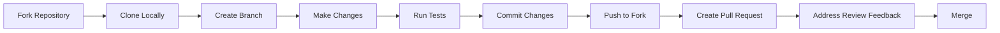

# Contributing to Traefik

Welcome to the Traefik community! We're excited that you're interested in contributing to Traefik, a modern HTTP reverse proxy and load balancer for microservices.

We strongly promote a philosophy of openness and sharing, and firmly stand against the elitist closed approach. Being part of the core team should be accessible to anyone motivated and willing to be part of that journey.

## Ways to Contribute

There are many ways you can contribute to Traefik:

<Steps>
  <Step title="Report Issues">
    Found a bug? [Submit an issue](https://github.com/traefik/traefik/issues/new/choose) on GitHub with detailed information about the problem.
  </Step>
  
  <Step title="Fix Bugs">
    Check out the [confirmed bugs](https://github.com/traefik/traefik/labels/kind%2Fbug%2Fconfirmed) list and submit a pull request with your fix.
  </Step>
  
  <Step title="Add Features">
    Look at [Priority Issues](https://github.com/traefik/traefik/labels/contributor%2Fwanted) or [Good First Issues](https://github.com/traefik/traefik/labels/contributor%2Fgood-first-issue) for enhancement opportunities.
  </Step>
  
  <Step title="Improve Documentation">
    Help make the documentation clearer and more comprehensive for everyone.
  </Step>
  
  <Step title="Advocate">
    Share your Traefik knowledge on forums, social media, or at meetups.
  </Step>
</Steps>

## Getting Started

Before you start contributing, here are the key resources you should familiarize yourself with:

### Essential Documentation

- **[Building and Testing](/contributing/building)** - Set up your development environment and learn how to build Traefik from source
- **[Contribution Guidelines](/contributing/guidelines)** - Understand our code standards, PR process, and best practices
- **[Triage Process](https://github.com/traefik/contributors-guide/blob/master/issue_triage.md)** - Learn how we manage issues and pull requests

### Quick Links

<CardGroup cols={2}>
  <Card title="Submit Pull Requests" icon="code-pull-request" href="https://doc.traefik.io/traefik/contributing/submitting-pull-requests/">
    Guidelines for creating effective pull requests
  </Card>
  
  <Card title="Report Issues" icon="bug" href="https://doc.traefik.io/traefik/contributing/submitting-issues/">
    How to submit helpful bug reports
  </Card>
  
  <Card title="Security Issues" icon="shield" href="https://doc.traefik.io/traefik/contributing/submitting-security-issues/">
    Report security vulnerabilities responsibly
  </Card>
  
  <Card title="Advocate" icon="megaphone" href="https://doc.traefik.io/traefik/contributing/advocating/">
    Help spread the word about Traefik
  </Card>
</CardGroup>

## Priority Areas

We're able to review and merge these contributions the fastest:

1. **Documentation updates** - Help keep our docs accurate and clear
2. **Bug fixes** - Especially for confirmed bugs
3. **Enhancements with `contributor/wanted` tag** - Features the community has prioritized

<Note>
For enhancements or features without the `contributor/wanted` tag, please [create an issue](https://github.com/traefik/traefik/issues/new/choose) first to discuss the proposal before starting work. This helps ensure your contribution aligns with project goals and can be merged.
</Note>

## Development Workflow

Here's the typical workflow for contributing code:



<Steps>
  <Step title="Fork and Clone">
    Fork the repository and clone it to your local machine.
  </Step>
  
  <Step title="Set Up Environment">
    Install dependencies and ensure you can build Traefik. See [Building and Testing](/contributing/building) for details.
  </Step>
  
  <Step title="Create a Branch">
    Create a feature branch for your changes:
    ```bash
    git checkout -b feature/my-contribution
    ```
  </Step>
  
  <Step title="Make Changes">
    Implement your changes following our [contribution guidelines](/contributing/guidelines).
  </Step>
  
  <Step title="Test Locally">
    Run all tests and validation checks before submitting.
  </Step>
  
  <Step title="Submit Pull Request">
    Push your changes and create a pull request with a clear description.
  </Step>
</Steps>

## Code of Conduct

This project is released with a [Contributor Code of Conduct](https://github.com/traefik/traefik/blob/master/CODE_OF_CONDUCT.md). By participating, you agree to abide by its terms.

<Tip>
**New to Open Source?** Start with a [Good First Issue](https://github.com/traefik/traefik/labels/contributor%2Fgood-first-issue) - these are typically smaller, well-defined tasks perfect for getting familiar with the codebase.
</Tip>

## Becoming a Maintainer

Interested in becoming a core maintainer? We welcome motivated contributors! Check out the [Maintainer's Guidelines](https://doc.traefik.io/traefik/contributing/maintainers-guidelines/) to learn about the path to maintainership and the responsibilities involved.

## Community Support

Need help or have questions?

- **Community Forum**: Join discussions at [community.traefik.io](https://community.traefik.io/)
- **GitHub Issues**: Search existing issues or create a new one
- **Documentation**: Explore the full documentation at [doc.traefik.io](https://doc.traefik.io/traefik/)

## Next Steps

Ready to contribute? Here's what to do next:

1. Read the [Building and Testing guide](/contributing/building) to set up your development environment
2. Review the [Contribution Guidelines](/contributing/guidelines) to understand our standards
3. Pick an issue or feature to work on
4. Join the conversation on our [community forum](https://community.traefik.io/)

Thank you for contributing to Traefik!
