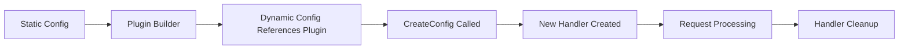
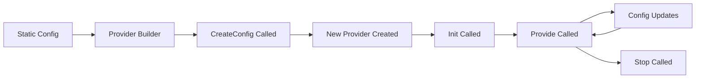

# Plugins Overview

Traefik's plugin system allows you to extend its capabilities with custom middleware and provider plugins. Plugins are dynamically loaded and can be written in Go (using Yaegi interpreter) or WebAssembly (Wasm), providing a flexible way to add custom functionality without modifying Traefik's core codebase.

## Plugin Architecture

Traefik supports two types of plugins:

1. **Middleware Plugins** - Extend request/response processing
2. **Provider Plugins** - Integrate custom configuration sources

Plugins can run in two different runtimes:

- **Yaegi** - Go interpreter for running Go code dynamically (default)
- **WebAssembly (Wasm)** - Sandbox environment for Wasm modules

<Note>
The plugin system is part of Traefik's experimental features and provides a powerful way to customize Traefik's behavior without forking or modifying the source code.
</Note>

## Plugin Types

### Middleware Plugins

Middleware plugins allow you to process HTTP requests and responses. They can:

- Modify request headers
- Transform request/response bodies
- Implement custom authentication logic
- Add rate limiting or throttling
- Perform custom logging and metrics

**Supported Runtimes**: Yaegi, WebAssembly

### Provider Plugins

Provider plugins enable integration with custom configuration sources. They can:

- Fetch configuration from custom APIs
- Integrate with proprietary service discovery systems
- Generate dynamic routing rules
- Connect to custom databases or configuration stores

**Supported Runtimes**: Yaegi only

## Plugin Sources

Traefik supports two ways to load plugins:

<Steps>
  <Step title="Remote Plugins">
    Plugins published to the [Plugin Catalog](https://plugins.traefik.io/) are downloaded automatically from GitHub repositories. These plugins are verified and can be installed by specifying the module name and version.
  </Step>
  
  <Step title="Local Plugins">
    Plugins stored in the `./plugins-local/` directory relative to Traefik's working directory. These are useful for development, testing, or proprietary plugins that shouldn't be published publicly.
  </Step>
</Steps>

## Plugin Manifest

Every plugin must include a `.traefik.yml` manifest file at its root. This file describes the plugin's metadata and configuration:

```yaml .traefik.yml
displayName: My Custom Plugin
type: middleware  # or "provider"
runtime: yaegi    # or "wasm" (middleware only)
import: github.com/user/my-plugin
basePkg: myplugin
summary: A brief description of what this plugin does
testData:
  option1: value1
  option2: value2
```

### Manifest Fields

| Field | Required | Description |
|-------|----------|-------------|
| `displayName` | Yes | Human-readable plugin name |
| `type` | Yes | Plugin type: `middleware` or `provider` |
| `runtime` | No | Runtime environment: `yaegi` (default) or `wasm` |
| `import` | Yes* | Go import path (Yaegi plugins only) |
| `basePkg` | No | Base package name (defaults to last path component) |
| `wasmPath` | No | Path to .wasm file (Wasm plugins, defaults to `plugin.wasm`) |
| `summary` | Yes | Short description of the plugin |
| `useUnsafe` | No | Whether plugin uses unsafe/syscall packages |
| `testData` | Yes | Sample configuration for testing |

*Required for Yaegi plugins

<Warning>
**Security Considerations**

Plugins run with the same privileges as Traefik. Exercise caution when:
- Installing plugins from untrusted sources
- Enabling `useUnsafe` mode (allows syscall and unsafe packages)
- Using plugins in production environments

Always review plugin code before deployment.
</Warning>

## Plugin Lifecycle

### Installation Process

<Steps>
  <Step title="Configuration">
    Plugin is defined in Traefik's static configuration under `experimental.plugins` (remote) or `experimental.localPlugins` (local).
  </Step>
  
  <Step title="Download & Validation">
    Remote plugins are downloaded from their GitHub repository. The module name and version are validated, and the archive hash is optionally checked.
  </Step>
  
  <Step title="Extraction">
    Plugin archive is extracted to the sources directory. The manifest file is read and validated.
  </Step>
  
  <Step title="Builder Creation">
    A plugin builder is created based on the runtime type (Yaegi or Wasm). For Yaegi plugins, an interpreter is initialized.
  </Step>
  
  <Step title="Ready for Use">
    Plugin is now available for use in dynamic configuration (middleware) or automatically started (provider).
  </Step>
</Steps>

### Middleware Plugin Lifecycle



1. **Builder Creation** - Plugin builder is created during Traefik startup
2. **Configuration** - Dynamic configuration references the plugin
3. **Instantiation** - `CreateConfig()` and `New()` functions are called
4. **Request Handling** - Plugin processes HTTP requests
5. **Cleanup** - Handler is garbage collected when no longer needed

### Provider Plugin Lifecycle



1. **Initialization** - `Init()` is called when provider starts
2. **Configuration** - `Provide()` is called to start configuration stream
3. **Updates** - Provider sends configuration updates via channel
4. **Shutdown** - `Stop()` is called during Traefik shutdown

## Plugin Storage

Traefik organizes plugin files in the following structure:

```
./plugins-storage/
├── archives/          # Downloaded plugin archives
│   ├── github.com/
│   │   └── user/
│   │       └── plugin/
│   │           └── v1.0.0.zip
│   └── state.json    # Tracks installed versions
└── sources/           # Extracted plugin sources
    └── gop-xxxxx/     # Temporary GoPath
        └── src/
            └── github.com/
                └── user/
                    └── plugin/
                        ├── .traefik.yml
                        ├── plugin.go
                        └── ...

./plugins-local/       # Local plugin development
└── github.com/
    └── user/
        └── local-plugin/
            ├── .traefik.yml
            ├── plugin.go
            └── ...
```

## Runtime Comparison

| Feature | Yaegi | WebAssembly |
|---------|-------|-------------|
| **Language** | Go only | Any Wasm-compatible language |
| **Performance** | Native Go performance | Near-native with slight overhead |
| **Sandboxing** | Limited (Go interpreter) | Strong isolation |
| **Plugin Types** | Middleware & Provider | Middleware only |
| **Unsafe/Syscall** | Optional (via settings) | Not available |
| **File System Access** | Full access | Configurable mounts |
| **Environment Variables** | Full access | Configurable forwarding |
| **Development** | Easier (pure Go) | Requires Wasm toolchain |

## Plugin Interfaces

### Middleware Interface (Yaegi)

```go
package main

import (
    "context"
    "net/http"
)

// Config holds the plugin configuration
type Config struct {
    // Your configuration fields
}

// CreateConfig creates the default plugin configuration
func CreateConfig() *Config {
    return &Config{}
}

// New creates a new plugin instance
func New(ctx context.Context, next http.Handler, config *Config, name string) (http.Handler, error) {
    // Initialize and return your handler
    return &MyPlugin{next: next, config: config}, nil
}

type MyPlugin struct {
    next   http.Handler
    config *Config
}

func (m *MyPlugin) ServeHTTP(rw http.ResponseWriter, req *http.Request) {
    // Process the request
    m.next.ServeHTTP(rw, req)
}
```

### Provider Interface (Yaegi)

```go
package main

import (
    "context"
    "encoding/json"
)

type Config struct {
    // Your configuration fields
}

func CreateConfig() *Config {
    return &Config{}
}

func New(ctx context.Context, config *Config, name string) (*Provider, error) {
    return &Provider{config: config}, nil
}

type Provider struct {
    config *Config
}

func (p *Provider) Init() error {
    // Initialize the provider
    return nil
}

func (p *Provider) Provide(cfgChan chan<- json.Marshaler) error {
    // Send configuration updates to cfgChan
    return nil
}

func (p *Provider) Stop() error {
    // Cleanup resources
    return nil
}
```

## Configuration Options

### Remote Plugin Settings

```yaml
experimental:
  plugins:
    my-plugin:
      moduleName: github.com/user/my-plugin
      version: v1.0.0
      hash: sha256:abc123...  # Optional integrity check
      settings:
        useUnsafe: false       # Allow unsafe/syscall packages
        envs:                  # Wasm: environment variables to forward
          - API_KEY
          - DEBUG
        mounts:                # Wasm: directory mounts
          - /data:/plugin/data
          - /config:/plugin/config:ro
```

### Local Plugin Settings

```yaml
experimental:
  localPlugins:
    my-dev-plugin:
      moduleName: github.com/user/my-dev-plugin
      settings:
        useUnsafe: true        # Enable for development/testing
```

### Abort on Plugin Failure

```yaml
experimental:
  abortOnPluginFailure: true   # Traefik won't start if plugins fail to load
```

## Plugin Catalog

The [Traefik Plugin Catalog](https://plugins.traefik.io/) is a centralized repository of community and official plugins. Benefits include:

- **Discovery** - Browse available plugins by category
- **Verification** - Plugins are reviewed and tested
- **Installation** - Direct installation instructions
- **Documentation** - Plugin-specific documentation and examples
- **Ratings** - Community feedback and ratings

<Note>
You can access the Plugin Catalog directly from the Traefik Dashboard via the "Plugins" menu entry.
</Note>

## Best Practices

### Performance

- Keep plugin logic lightweight and efficient
- Avoid blocking operations in request handlers
- Use caching where appropriate
- Monitor plugin performance impact

### Security

- Review plugin source code before installation
- Use specific version tags, not `latest` or branches
- Enable `hash` verification for production deployments
- Minimize use of `useUnsafe` setting
- Restrict Wasm plugin file system access

### Development

- Test plugins locally before publishing
- Provide comprehensive test data in manifest
- Follow semantic versioning
- Document configuration options clearly
- Include examples in plugin repository

### Maintenance

- Keep plugins updated to latest versions
- Monitor plugin compatibility with Traefik versions
- Check plugin logs for errors or warnings
- Clean old plugin versions from archives

## Troubleshooting

### Plugin Not Loading

```bash
# Check plugin configuration
traefik --configFile=traefik.yml --log.level=DEBUG

# Common issues:
# - Module name mismatch in manifest
# - Missing or invalid .traefik.yml
# - Version tag doesn't exist
# - Network issues downloading plugin
```

### Hash Verification Failures

```yaml
# Use the hash from plugin installation logs
experimental:
  plugins:
    my-plugin:
      moduleName: github.com/user/my-plugin
      version: v1.0.0
      hash: sha256:actual-hash-from-logs
```

### Unsafe Package Errors

```yaml
# If plugin requires unsafe/syscall packages
experimental:
  plugins:
    my-plugin:
      moduleName: github.com/user/my-plugin
      version: v1.0.0
      settings:
        useUnsafe: true  # Enable with caution
```

## Next Steps

<CardGroup cols={2}>
  <Card title="Using Plugins" icon="plug" href="/plugins/usage">
    Learn how to install and configure plugins in your Traefik instance
  </Card>
  
  <Card title="Plugin Catalog" icon="store" href="https://plugins.traefik.io/">
    Browse the official catalog of available Traefik plugins
  </Card>
  
  <Card title="Create Plugins" icon="code" href="https://plugins.traefik.io/create">
    Developer guide for building your own Traefik plugins
  </Card>
  
  <Card title="Middleware Overview" icon="layer-group" href="/middlewares/overview">
    Learn about Traefik's built-in middleware system
  </Card>
</CardGroup>