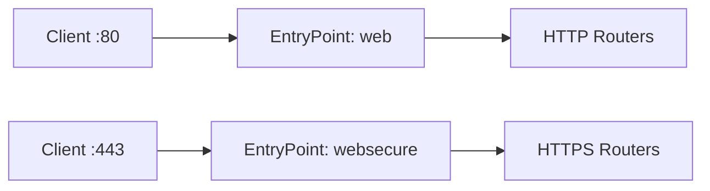

# EntryPoints

EntryPoints define network entry points where Traefik listens for incoming connections.

## What is an EntryPoint?

An EntryPoint specifies:
- **Port** to listen on (e.g., `:80`, `:443`)
- **Protocol** to use (TCP or UDP)
- **Address** to bind to (optional, defaults to all interfaces)

Every request enters Traefik through an EntryPoint before being routed to services.



<Note>
EntryPoints are configured in **static configuration** and require a Traefik restart to change.
</Note>

## Basic Configuration

<CodeGroup>
```yaml File (YAML)
entryPoints:
  web:
    address: ":80"
  
  websecure:
    address: ":443"
```

```toml File (TOML)
[entryPoints]
  [entryPoints.web]
    address = ":80"
  
  [entryPoints.websecure]
    address = ":443"
```

```bash CLI
--entryPoints.web.address=:80
--entryPoints.websecure.address=:443
```
</CodeGroup>

## Address Format

The `address` field follows this format:

```
[host]:port[/tcp|/udp]
```

<Tabs>
  <Tab title="Port Only">
    Listen on all interfaces:
    
    ```yaml
    entryPoints:
      web:
        address: ":80"      # TCP port 80
      dns:
        address: ":53/udp"  # UDP port 53
    ```
  </Tab>
  
  <Tab title="Specific IP">
    Listen on a specific IP address:
    
    ```yaml
    entryPoints:
      internal:
        address: "192.168.1.100:8080"
      
      ipv6:
        address: "[2001:db8::1]:8080"
    ```
  </Tab>
  
  <Tab title="TCP and UDP">
    Use the same port for both TCP and UDP:
    
    ```yaml
    entryPoints:
      tcp-3000:
        address: ":3000"      # TCP
      
      udp-3000:
        address: ":3000/udp"  # UDP
    ```
    
    <Note>
    Create separate EntryPoints for TCP and UDP on the same port.
    </Note>
  </Tab>
</Tabs>

## Common EntryPoint Configurations

### HTTP and HTTPS

Standard web server setup:

```yaml
entryPoints:
  web:
    address: ":80"
    http:
      redirections:
        entryPoint:
          to: websecure
          scheme: https
  
  websecure:
    address: ":443"
    http:
      tls:
        certResolver: letsencrypt
```

This automatically redirects HTTP to HTTPS.

### Custom Ports

```yaml
entryPoints:
  api:
    address: ":8080"
  
  metrics:
    address: ":9090"
  
  admin:
    address: "127.0.0.1:9000"  # Localhost only
```

### Multiple Protocols

```yaml
entryPoints:
  web:
    address: ":80"
  
  websecure:
    address: ":443"
  
  mysql:
    address: ":3306"
  
  postgres:
    address: ":5432"
  
  dns:
    address: ":53/udp"
```

## HTTP Configuration

HTTP-specific options for web traffic.

### Automatic HTTPS Redirect

Redirect all HTTP traffic to HTTPS:

```yaml
entryPoints:
  web:
    address: ":80"
    http:
      redirections:
        entryPoint:
          to: websecure
          scheme: https
          permanent: true  # 301 redirect
  
  websecure:
    address: ":443"
```

### TLS Configuration

Configure TLS for HTTPS:

<Tabs>
  <Tab title="Let's Encrypt">
    Automatic certificates with ACME:
    
    ```yaml
    entryPoints:
      websecure:
        address: ":443"
        http:
          tls:
            certResolver: letsencrypt
            domains:
              - main: "example.com"
                sans:
                  - "*.example.com"
    ```
  </Tab>
  
  <Tab title="Custom Certificates">
    Use specific TLS certificates:
    
    ```yaml
    entryPoints:
      websecure:
        address: ":443"
        http:
          tls:
            options: default
    
    # In dynamic configuration
    tls:
      certificates:
        - certFile: /path/to/cert.pem
          keyFile: /path/to/key.pem
    ```
  </Tab>
  
  <Tab title="TLS Options">
    Configure TLS versions and ciphers:
    
    ```yaml
    entryPoints:
      websecure:
        address: ":443"
        http:
          tls:
            options: strict
    
    # In dynamic configuration
    tls:
      options:
        strict:
          minVersion: VersionTLS12
          cipherSuites:
            - TLS_ECDHE_RSA_WITH_AES_128_GCM_SHA256
    ```
  </Tab>
</Tabs>

### HTTP/2 and HTTP/3

<CodeGroup>
```yaml HTTP/2 Configuration
entryPoints:
  websecure:
    address: ":443"
    http2:
      maxConcurrentStreams: 250
```

```yaml HTTP/3 Configuration
entryPoints:
  websecure:
    address: ":443"
    http3:
      advertisedPort: 443
```
</CodeGroup>

<Note>
HTTP/3 automatically creates a UDP listener on the same port as the TCP EntryPoint.
</Note>

### Middleware on EntryPoints

Apply middleware to all routers using an EntryPoint:

```yaml
entryPoints:
  web:
    address: ":80"
    http:
      middlewares:
        - global-ratelimit@file
        - security-headers@file

# In dynamic configuration
http:
  middlewares:
    global-ratelimit:
      rateLimit:
        average: 100
        burst: 50
    
    security-headers:
      headers:
        customResponseHeaders:
          X-Frame-Options: "DENY"
          X-Content-Type-Options: "nosniff"
```

## Transport Configuration

Configure connection timeouts and lifecycle.

### Timeouts

```yaml
entryPoints:
  web:
    address: ":80"
    transport:
      respondingTimeouts:
        readTimeout: "60s"
        writeTimeout: "60s"
        idleTimeout: "180s"
      lifeCycle:
        requestAcceptGraceTimeout: "10s"
        graceTimeOut: "30s"
```

<ParamField path="readTimeout" type="duration">
  Maximum duration for reading request including body (default: `60s`).
</ParamField>

<ParamField path="writeTimeout" type="duration">
  Maximum duration for writing response (default: `0s` - no timeout).
</ParamField>

<ParamField path="idleTimeout" type="duration">
  Maximum duration for idle keep-alive connections (default: `180s`).
</ParamField>

### Graceful Shutdown

```yaml
entryPoints:
  web:
    address: ":80"
    transport:
      lifeCycle:
        requestAcceptGraceTimeout: "10s"  # Wait before stopping new requests
        graceTimeOut: "30s"               # Wait for in-flight requests
```

### Keep-Alive Limits

```yaml
entryPoints:
  web:
    address: ":80"
    transport:
      keepAliveMaxRequests: 100    # Close after 100 requests
      keepAliveMaxTime: "300s"     # Close after 5 minutes
```

## Forwarded Headers

Trust proxy headers like `X-Forwarded-For`:

<Tabs>
  <Tab title="Trusted IPs">
    Trust specific proxy IPs:
    
    ```yaml
    entryPoints:
      web:
        address: ":80"
        forwardedHeaders:
          trustedIPs:
            - "127.0.0.1/32"
            - "192.168.1.0/24"
            - "10.0.0.0/8"
    ```
  </Tab>
  
  <Tab title="Insecure Mode">
    Trust all forwarded headers (development only):
    
    ```yaml
    entryPoints:
      web:
        address: ":80"
        forwardedHeaders:
          insecure: true
    ```
    
    <Warning>
    Never use `insecure: true` in production - it allows IP spoofing.
    </Warning>
  </Tab>
</Tabs>

## Proxy Protocol

Support HAProxy PROXY protocol:

```yaml
entryPoints:
  web:
    address: ":80"
    proxyProtocol:
      trustedIPs:
        - "127.0.0.1/32"
        - "192.168.1.7"
```

<Note>
Proxy Protocol supports versions 1 and 2. The version is auto-detected.
</Note>

## Default EntryPoints

Mark EntryPoints as default for routers that don't specify entryPoints:

```yaml
entryPoints:
  web:
    address: ":80"
  
  websecure:
    address: ":443"
    asDefault: true  # Routers use this by default
  
  admin:
    address: ":9000"  # Not default
```

<Note>
If no EntryPoint has `asDefault: true`, routers listen on all EntryPoints by default.
</Note>

## Advanced Features

### ReusePort

Allow multiple Traefik processes to bind to the same port (Linux only):

```yaml
entryPoints:
  web:
    address: ":80"
    reusePort: true
```

Useful for:
- Zero-downtime deployments
- Canary releases
- Load balancing across processes

<Warning>
Only supported on Linux, FreeBSD, OpenBSD, and Darwin. Has known kernel bugs on older Linux versions.
</Warning>

### Encoded Characters

Control handling of encoded characters in request paths:

```yaml
entryPoints:
  web:
    address: ":80"
    http:
      encodedCharacters:
        allowEncodedSlash: false        # Reject %2F
        allowEncodedBackSlash: false    # Reject %5C
        allowEncodedNullCharacter: false # Reject %00
```

### Path Sanitization

```yaml
entryPoints:
  web:
    address: ":80"
    http:
      sanitizePath: true  # Clean paths like /./foo/../bar to /bar
```

<Warning>
Setting `sanitizePath: false` can lead to security vulnerabilities. Only disable if you have a specific need.
</Warning>

## Real-World Examples

<AccordionGroup>
  <Accordion title="Production web server">
    Complete production setup with security:
    
    ```yaml
    entryPoints:
      web:
        address: ":80"
        http:
          redirections:
            entryPoint:
              to: websecure
              scheme: https
              permanent: true
      
      websecure:
        address: ":443"
        asDefault: true
        http:
          tls:
            certResolver: letsencrypt
          middlewares:
            - security-headers@file
            - rate-limit@file
        http2:
          maxConcurrentStreams: 250
        http3:
          advertisedPort: 443
        forwardedHeaders:
          trustedIPs:
            - "10.0.0.0/8"  # Internal network
        transport:
          respondingTimeouts:
            readTimeout: "60s"
            writeTimeout: "60s"
            idleTimeout: "180s"
    ```
  </Accordion>
  
  <Accordion title="Multi-service architecture">
    Multiple EntryPoints for different services:
    
    ```yaml
    entryPoints:
      # Public web traffic
      web:
        address: ":80"
        http:
          redirections:
            entryPoint:
              to: websecure
      
      websecure:
        address: ":443"
        http:
          tls:
            certResolver: letsencrypt
      
      # Internal API (localhost only)
      api:
        address: "127.0.0.1:8080"
      
      # Database proxy
      postgres:
        address: ":5432"
      
      mysql:
        address: ":3306"
      
      # Metrics
      metrics:
        address: "192.168.1.100:9090"
      
      # DNS
      dns:
        address: ":53/udp"
    ```
  </Accordion>
  
  <Accordion title="Behind load balancer">
    Traefik behind AWS ALB or GCP Load Balancer:
    
    ```yaml
    entryPoints:
      web:
        address: ":80"
        forwardedHeaders:
          trustedIPs:
            # AWS ALB IP ranges
            - "10.0.0.0/8"
        proxyProtocol:
          trustedIPs:
            - "10.0.0.0/8"
        transport:
          respondingTimeouts:
            readTimeout: "60s"
          lifeCycle:
            requestAcceptGraceTimeout: "30s"
            graceTimeOut: "60s"
    ```
  </Accordion>
</AccordionGroup>

## Next Steps

<CardGroup cols={2}>
  <Card title="Configure Routers" icon="route" href="/routing/routers">
    Create routing rules to match and forward requests
  </Card>
  
  <Card title="Setup TLS" icon="lock" href="/https/overview">
    Configure HTTPS certificates and TLS options
  </Card>
</CardGroup>
