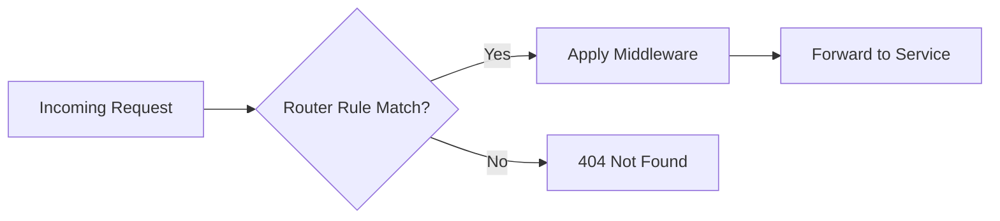

# Routers

Routers connect incoming requests to services based on matching rules.

## What is a Router?

A router analyzes incoming requests and determines which service should handle them based on configured **rules**. Routers can also apply middleware before forwarding requests.



<Note>
Routers are configured in **dynamic configuration** and can be updated without restarting Traefik.
</Note>

## HTTP Routers

HTTP routers match requests using powerful rule matchers.

### Basic Router Configuration

<CodeGroup>
```yaml YAML
http:
  routers:
    my-router:
      rule: "Host(`example.com`)"
      service: my-service
      entryPoints:
        - web
```

```toml TOML
[http.routers]
  [http.routers.my-router]
    rule = "Host(`example.com`)"
    service = "my-service"
    entryPoints = ["web"]
```

```yaml Docker Labels
labels:
  - "traefik.http.routers.my-router.rule=Host(`example.com`)"
  - "traefik.http.routers.my-router.service=my-service"
  - "traefik.http.routers.my-router.entrypoints=web"
```
</CodeGroup>

### Router Configuration Options

<ParamField path="rule" type="string" required>
  The matching rule that determines if this router handles a request. See [Routing Rules](#routing-rules) below.
  
  ```yaml
  rule: "Host(`example.com`) && PathPrefix(`/api`)"
  ```
</ParamField>

<ParamField path="service" type="string" required>
  The name of the service to forward matched requests to.
  
  ```yaml
  service: "my-backend-service"
  ```
</ParamField>

<ParamField path="entryPoints" type="array">
  List of entry points to listen on. If not specified, router listens on all default entry points.
  
  ```yaml
  entryPoints:
    - web
    - websecure
  ```
</ParamField>

<ParamField path="middlewares" type="array">
  List of middleware to apply before forwarding to the service.
  
  ```yaml
  middlewares:
    - auth
    - ratelimit
  ```
</ParamField>

<ParamField path="priority" type="integer">
  Router priority. Higher values take precedence. Default is rule length.
  
  ```yaml
  priority: 100
  ```
</ParamField>

<ParamField path="tls" type="object">
  TLS configuration for HTTPS routers.
  
  ```yaml
  tls:
    certResolver: letsencrypt
  ```
</ParamField>

## Routing Rules

Rules determine which requests match a router. Traefik provides multiple matchers that can be combined with logical operators.

### Available Matchers

Traefik implements these matchers in `pkg/muxer/http/matcher.go:16-28`:

| Matcher | Description | Example |
|---------|-------------|----------|
| `Host()` | Match request host | `Host(`example.com`)` |
| `HostRegexp()` | Match host with regex | `HostRegexp(`^.+\.example\.com$`)` |
| `Path()` | Match exact path | `Path(`/api`)` |
| `PathPrefix()` | Match path prefix | `PathPrefix(`/api`)` |
| `PathRegexp()` | Match path with regex | `PathRegexp(`^/api/v[0-9]+`)` |
| `Method()` | Match HTTP method | `Method(`POST`)` |
| `Header()` | Match header value | `Header(`Content-Type`, `application/json`)` |
| `HeaderRegexp()` | Match header with regex | `HeaderRegexp(`Content-Type`, `^application/(json\|yaml)$`)` |
| `Query()` | Match query parameter | `Query(`mobile`, `true`)` |
| `QueryRegexp()` | Match query with regex | `QueryRegexp(`version`, `^v[0-9]+$`)` |
| `ClientIP()` | Match client IP/CIDR | `ClientIP(`192.168.1.0/24`)` |

### Host Matching

<Tabs>
  <Tab title="Exact Host">
    Match a specific domain:
    
    ```yaml
    rule: "Host(`api.example.com`)"
    ```
    
    <Note>
    Host matching is case-insensitive and automatically handles trailing periods.
    </Note>
  </Tab>
  
  <Tab title="Multiple Hosts">
    Match multiple domains:
    
    ```yaml
    rule: "Host(`example.com`) || Host(`example.org`)"
    ```
  </Tab>
  
  <Tab title="Host Regex">
    Match subdomains with regex:
    
    ```yaml
    # Match any subdomain of example.com
    rule: "HostRegexp(`^.+\.example\.com$`)"
    
    # Match staging subdomains
    rule: "HostRegexp(`^.+-staging\.example\.com$`)"
    ```
  </Tab>
</Tabs>

### Path Matching

<Tabs>
  <Tab title="Exact Path">
    Match an exact path:
    
    ```yaml
    # Matches /api only, not /api/ or /api/users
    rule: "Path(`/api`)"
    ```
  </Tab>
  
  <Tab title="Path Prefix">
    Match path prefix:
    
    ```yaml
    # Matches /api, /api/, /api/users, /api-docs
    rule: "PathPrefix(`/api`)"
    ```
    
    <Warning>
    `PathPrefix` matches any path starting with the prefix, including `/api-docs`. For strict matching, combine with other rules.
    </Warning>
  </Tab>
  
  <Tab title="Path Regex">
    Match paths with regex:
    
    ```yaml
    # Match versioned API paths
    rule: "PathRegexp(`^/api/v[0-9]+`)"
    
    # Match image files
    rule: "PathRegexp(`\\.(jpg|png|gif)$`)"
    ```
  </Tab>
</Tabs>

### Header Matching

<CodeGroup>
```yaml Exact Header
# Match Content-Type header
rule: "Header(`Content-Type`, `application/json`)"
```

```yaml Header Regex
# Match JSON or YAML content types
rule: "HeaderRegexp(`Content-Type`, `^application/(json|yaml)$`)"

# Case-insensitive header matching
rule: "HeaderRegexp(`Content-Type`, `(?i)^application/json$`)"
```

```yaml Custom Headers
# Match API version header
rule: "Header(`X-API-Version`, `v2`)"

# Match mobile clients
rule: "HeaderRegexp(`User-Agent`, `Mobile|Android|iPhone`)"
```
</CodeGroup>

### Query Parameter Matching

<CodeGroup>
```yaml Query Value
# Match ?mobile=true
rule: "Query(`mobile`, `true`)"

# Match presence of parameter (any value)
rule: "Query(`debug`)"
```

```yaml Query Regex
# Match version parameter (v1, v2, etc.)
rule: "QueryRegexp(`version`, `^v[0-9]+$`)"

# Match true/yes values
rule: "QueryRegexp(`enabled`, `^(true|yes|1)$`)"
```
</CodeGroup>

### Method Matching

```yaml
# Match POST requests
rule: "Method(`POST`)"

# Match multiple methods
rule: "Method(`PUT`) || Method(`PATCH`)"

# Combine with path for REST API
rule: "Method(`POST`) && PathPrefix(`/api`)"
```

### Client IP Matching

<CodeGroup>
```yaml Single IP
# Match specific client IP
rule: "ClientIP(`192.168.1.100`)"

# IPv6 address
rule: "ClientIP(`2001:db8::1`)"
```

```yaml CIDR Range
# Match IP range
rule: "ClientIP(`192.168.1.0/24`)"

# Match multiple ranges
rule: "ClientIP(`192.168.1.0/24`) || ClientIP(`10.0.0.0/8`)"
```
</CodeGroup>

<Warning>
`ClientIP()` matches the actual client IP, not `X-Forwarded-For` headers. Configure `forwardedHeaders` on EntryPoints to trust proxy headers.
</Warning>

### Combining Rules

Use logical operators to create complex routing rules:

<Tabs>
  <Tab title="AND Operator">
    Both conditions must match:
    
    ```yaml
    # API subdomain AND /v2 path
    rule: "Host(`api.example.com`) && PathPrefix(`/v2`)"
    
    # Internal IP AND admin path
    rule: "ClientIP(`10.0.0.0/8`) && PathPrefix(`/admin`)"
    
    # POST method AND JSON content
    rule: "Method(`POST`) && Header(`Content-Type`, `application/json`)"
    ```
  </Tab>
  
  <Tab title="OR Operator">
    Either condition can match:
    
    ```yaml
    # Multiple domains
    rule: "Host(`example.com`) || Host(`example.org`)"
    
    # Multiple paths
    rule: "PathPrefix(`/api`) || PathPrefix(`/v1`)"
    
    # Development or staging
    rule: "Host(`dev.example.com`) || Host(`staging.example.com`)"
    ```
  </Tab>
  
  <Tab title="NOT Operator">
    Exclude matching requests:
    
    ```yaml
    # All paths except /admin
    rule: "!PathPrefix(`/admin`)"
    
    # Example.com but not admin subdomain
    rule: "Host(`example.com`) && !Host(`admin.example.com`)"
    
    # API but not health checks
    rule: "PathPrefix(`/api`) && !Path(`/api/health`)"
    ```
  </Tab>
  
  <Tab title="Parentheses">
    Group conditions with parentheses:
    
    ```yaml
    # (API OR v1) AND example.com
    rule: "(PathPrefix(`/api`) || PathPrefix(`/v1`)) && Host(`example.com`)"
    
    # Complex routing logic
    rule: "Host(`example.com`) && (PathPrefix(`/api`) || PathPrefix(`/v1`)) && !Path(`/api/internal`)"
    ```
  </Tab>
</Tabs>

## Router Priority

When multiple routers match a request, priority determines which router handles it.

<CodeGroup>
```yaml Default Priority
http:
  routers:
    # Priority: 42 (rule length)
    specific:
      rule: "Host(`api.example.com`) && PathPrefix(`/v2/users`)"
      service: users-v2
    
    # Priority: 36 (rule length)
    general:
      rule: "Host(`api.example.com`) && PathPrefix(`/v2`)"
      service: api-v2
```

```yaml Manual Priority
http:
  routers:
    # Priority: 200 (highest)
    health-check:
      rule: "Path(`/health`)"
      priority: 200
      service: health-service
    
    # Priority: 100
    api:
      rule: "PathPrefix(`/api`)"
      priority: 100
      service: api-service
    
    # Priority: 50 (lowest)
    default:
      rule: "PathPrefix(`/`)"
      priority: 50
      service: default-service
```
</CodeGroup>

<Note>
Higher priority values are evaluated first. Default priority is the character length of the rule string.
</Note>

## Middleware Integration

Routers can apply middleware before forwarding to services:

```yaml
http:
  routers:
    api-router:
      rule: "Host(`api.example.com`)"
      service: api-service
      middlewares:
        - api-auth       # Applied first
        - api-ratelimit  # Applied second
        - api-compress   # Applied third
  
  middlewares:
    api-auth:
      basicAuth:
        users:
          - "admin:$apr1$H6uskkkW$IgXLP6ewTrSuBkTrqE8wj/"
    
    api-ratelimit:
      rateLimit:
        average: 100
        burst: 50
    
    api-compress:
      compress: {}
```

See the [Middleware documentation](/middleware/overview) for available middleware options.

## TLS Configuration

Enable HTTPS and automatic certificate management:

<Tabs>
  <Tab title="Automatic HTTPS">
    Use Let's Encrypt for automatic certificates:
    
    ```yaml
    http:
      routers:
        secure-router:
          rule: "Host(`example.com`)"
          service: my-service
          entryPoints:
            - websecure
          tls:
            certResolver: letsencrypt
    ```
  </Tab>
  
  <Tab title="Custom Certificates">
    Use specific TLS certificates:
    
    ```yaml
    http:
      routers:
        secure-router:
          rule: "Host(`example.com`)"
          service: my-service
          tls:
            options: default
            domains:
              - main: "example.com"
                sans:
                  - "*.example.com"
    ```
  </Tab>
  
  <Tab title="TLS Passthrough">
    Pass TLS through to backend (for TCP routers):
    
    ```yaml
    tcp:
      routers:
        secure-tcp:
          rule: "HostSNI(`db.example.com`)"
          service: postgres
          tls:
            passthrough: true
    ```
  </Tab>
</Tabs>

## TCP Routers

TCP routers have limited rule matching compared to HTTP:

```yaml
tcp:
  routers:
    database-router:
      rule: "HostSNI(`db.example.com`)"
      service: postgres-service
      entryPoints:
        - database
      tls:
        certResolver: letsencrypt
  
  services:
    postgres-service:
      loadBalancer:
        servers:
          - address: "10.0.1.20:5432"
```

<Note>
TCP routers only support `HostSNI()` matching for TLS connections. Non-TLS TCP uses `HostSNI(`*`)` to match all traffic.
</Note>

## UDP Routers

UDP routers don't use rules - all traffic on an entry point goes to the service:

```yaml
udp:
  routers:
    dns-router:
      service: dns-service
      entryPoints:
        - dns
  
  services:
    dns-service:
      loadBalancer:
        servers:
          - address: "10.0.1.30:53"
```

## Real-World Examples

<AccordionGroup>
  <Accordion title="Multi-tenant API routing">
    Route different tenants to different services:
    
    ```yaml
    http:
      routers:
        tenant-a:
          rule: "Host(`tenant-a.api.example.com`)"
          service: tenant-a-service
          priority: 100
        
        tenant-b:
          rule: "Host(`tenant-b.api.example.com`)"
          service: tenant-b-service
          priority: 100
        
        default-tenant:
          rule: "HostRegexp(`^.+\\.api\\.example\\.com$`)"
          service: default-service
          priority: 50
    ```
  </Accordion>
  
  <Accordion title="API versioning">
    Route API versions to different services:
    
    ```yaml
    http:
      routers:
        api-v2:
          rule: "Host(`api.example.com`) && PathPrefix(`/v2`)"
          service: api-v2-service
          priority: 200
        
        api-v1:
          rule: "Host(`api.example.com`) && PathPrefix(`/v1`)"
          service: api-v1-service
          priority: 150
        
        api-default:
          rule: "Host(`api.example.com`)"
          service: api-v2-service  # Default to latest
          priority: 100
    ```
  </Accordion>
  
  <Accordion title="Blue-green deployment">
    Route traffic based on headers for testing:
    
    ```yaml
    http:
      routers:
        green-deployment:
          rule: "Host(`app.example.com`) && Header(`X-Version`, `green`)"
          service: green-service
          priority: 200
        
        blue-deployment:
          rule: "Host(`app.example.com`)"
          service: blue-service
          priority: 100
    ```
  </Accordion>
  
  <Accordion title="Geographic routing">
    Route based on client IP ranges:
    
    ```yaml
    http:
      routers:
        eu-region:
          rule: "Host(`app.example.com`) && ClientIP(`10.1.0.0/16`)"
          service: eu-service
          priority: 200
        
        us-region:
          rule: "Host(`app.example.com`) && ClientIP(`10.2.0.0/16`)"
          service: us-service
          priority: 200
        
        default-region:
          rule: "Host(`app.example.com`)"
          service: us-service
          priority: 100
    ```
  </Accordion>
</AccordionGroup>

## Next Steps

<CardGroup cols={2}>
  <Card title="Configure Services" icon="server" href="/routing/services">
    Set up load balancing and health checks for your backends
  </Card>
  
  <Card title="Add Middleware" icon="filter" href="/middleware/overview">
    Transform requests with authentication, rate limiting, and more
  </Card>
</CardGroup>
