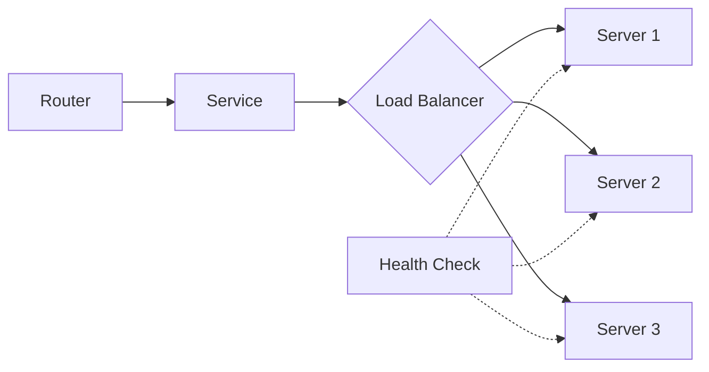

# Services

Services define how to reach backend servers and handle load balancing.

## What is a Service?

A service configures how Traefik forwards requests to your backend servers. Each service defines:

- **Servers**: One or more backend server addresses
- **Load Balancing**: Algorithm to distribute requests
- **Health Checks**: Monitoring to remove unhealthy servers
- **Sticky Sessions**: Route clients to the same server



## HTTP Services

HTTP services use the `loadBalancer` configuration to distribute requests across backend servers.

### Basic Service Configuration

<CodeGroup>
```yaml YAML
http:
  services:
    my-service:
      loadBalancer:
        servers:
          - url: "http://10.0.1.10:8080"
          - url: "http://10.0.1.11:8080"
          - url: "http://10.0.1.12:8080"
```

```toml TOML
[http.services]
  [http.services.my-service.loadBalancer]
    [[http.services.my-service.loadBalancer.servers]]
      url = "http://10.0.1.10:8080"
    [[http.services.my-service.loadBalancer.servers]]
      url = "http://10.0.1.11:8080"
    [[http.services.my-service.loadBalancer.servers]]
      url = "http://10.0.1.12:8080"
```

```yaml Docker Labels
labels:
  - "traefik.http.services.my-service.loadbalancer.server.port=8080"
```
</CodeGroup>

### Service Configuration Options

<ParamField path="servers" type="array" required>
  List of backend server URLs.
  
  ```yaml
  servers:
    - url: "http://10.0.1.10:8080"
    - url: "http://10.0.1.11:8080"
  ```
</ParamField>

<ParamField path="strategy" type="string">
  Load balancing algorithm: `wrr` (default), `p2c`, or `hrw`.
  
  ```yaml
  strategy: "p2c"
  ```
</ParamField>

<ParamField path="healthCheck" type="object">
  Health check configuration to monitor server availability.
  
  ```yaml
  healthCheck:
    path: /health
    interval: "10s"
  ```
</ParamField>

<ParamField path="sticky" type="object">
  Sticky session configuration using cookies.
  
  ```yaml
  sticky:
    cookie:
      name: "lb_cookie"
  ```
</ParamField>

<ParamField path="passHostHeader" type="boolean">
  Forward the `Host` header to backend servers (default: `true`).
  
  ```yaml
  passHostHeader: true
  ```
</ParamField>

## Load Balancing Algorithms

Traefik supports three load balancing strategies with different characteristics.

### Weighted Round Robin (WRR)

Default algorithm using Earliest Deadline First (EDF) scheduling. Implemented in `pkg/server/service/loadbalancer/wrr/wrr.go`.

<Tabs>
  <Tab title="Equal Weights">
    Distribute requests evenly across all servers:
    
    ```yaml
    http:
      services:
        api-service:
          loadBalancer:
            servers:
              - url: "http://10.0.1.10:8080"
              - url: "http://10.0.1.11:8080"
              - url: "http://10.0.1.12:8080"
    ```
    
    Each server receives ~33% of traffic.
  </Tab>
  
  <Tab title="Custom Weights">
    Distribute traffic proportionally based on server capacity:
    
    ```yaml
    http:
      services:
        api-service:
          loadBalancer:
            servers:
              - url: "http://10.0.1.10:8080"
                weight: 3  # 60% of traffic
              - url: "http://10.0.1.11:8080"
                weight: 2  # 40% of traffic
    ```
    
    Higher weights receive more requests.
  </Tab>
</Tabs>

<Note>
WRR uses O(log n) selection time with a heap-based implementation for efficient server selection.
</Note>

### Power of Two Choices (P2C)

Selects two random servers and chooses the one with fewer active requests. Implemented in `pkg/server/service/loadbalancer/p2c/p2c.go`.

```yaml
http:
  services:
    api-service:
      loadBalancer:
        strategy: "p2c"
        servers:
          - url: "http://10.0.1.10:8080"
          - url: "http://10.0.1.11:8080"
          - url: "http://10.0.1.12:8080"
```

**When to use P2C:**
- High-concurrency applications
- Servers with varying response times
- Distributed deployments without central coordination
- Better "herd behavior" than least connections

<Note>
P2C provides O(1) selection time by randomly sampling two servers instead of checking all servers.
</Note>

### Highest Random Weight (HRW)

Rendezvous hashing that routes clients consistently to the same server based on client IP. Implemented in `pkg/server/service/loadbalancer/hrw/hrw.go`.

```yaml
http:
  services:
    api-service:
      loadBalancer:
        strategy: "hrw"
        servers:
          - url: "http://10.0.1.10:8080"
            weight: 2
          - url: "http://10.0.1.11:8080"
            weight: 1
```

**When to use HRW:**
- Cache-heavy applications (consistent routing to same server)
- Session affinity without sticky cookies
- Minimal disruption when adding/removing servers

<Warning>
HRW uses client IP for routing. Requests from the same IP always go to the same backend (unless server is unhealthy).
</Warning>

## Health Checks

Health checks automatically remove unhealthy servers from load balancing rotation.

### Basic Health Check

```yaml
http:
  services:
    api-service:
      loadBalancer:
        servers:
          - url: "http://10.0.1.10:8080"
          - url: "http://10.0.1.11:8080"
        healthCheck:
          path: /health
          interval: "10s"
          timeout: "3s"
```

### Health Check Options

<ParamField path="path" type="string" required>
  Health check endpoint path (relative URL).
  
  ```yaml
  path: /health
  ```
</ParamField>

<ParamField path="interval" type="duration">
  Frequency of health checks for healthy servers (default: `30s`).
  
  ```yaml
  interval: "10s"
  ```
</ParamField>

<ParamField path="unhealthyInterval" type="duration">
  Frequency of health checks for unhealthy servers (default: same as `interval`).
  
  ```yaml
  unhealthyInterval: "5s"
  ```
</ParamField>

<ParamField path="timeout" type="duration">
  Maximum duration to wait for health check response (default: `5s`).
  
  ```yaml
  timeout: "3s"
  ```
</ParamField>

<ParamField path="scheme" type="string">
  Override URL scheme for health checks (`http` or `https`).
  
  ```yaml
  scheme: https
  ```
</ParamField>

<ParamField path="hostname" type="string">
  Hostname to use in `Host` header for health checks.
  
  ```yaml
  hostname: "health.example.com"
  ```
</ParamField>

<ParamField path="port" type="integer">
  Override port for health check endpoint.
  
  ```yaml
  port: 9000
  ```
</ParamField>

<ParamField path="method" type="string">
  HTTP method for health checks (default: `GET`).
  
  ```yaml
  method: "HEAD"
  ```
</ParamField>

<ParamField path="status" type="integer">
  Expected HTTP status code (default: accept any 2xx or 3xx).
  
  ```yaml
  status: 200
  ```
</ParamField>

<ParamField path="headers" type="object">
  Custom headers to send with health check requests.
  
  ```yaml
  headers:
    Authorization: "Bearer token123"
    X-Custom-Header: "value"
  ```
</ParamField>

<ParamField path="followRedirects" type="boolean">
  Follow redirects during health checks (default: `true`).
  
  ```yaml
  followRedirects: false
  ```
</ParamField>

<ParamField path="mode" type="string">
  Health check mode: `http` (default) or `grpc`.
  
  ```yaml
  mode: grpc
  ```
</ParamField>

### Advanced Health Check Examples

<AccordionGroup>
  <Accordion title="Custom health check endpoint">
    Use dedicated health check port and path:
    
    ```yaml
    http:
      services:
        api-service:
          loadBalancer:
            servers:
              - url: "http://10.0.1.10:8080"
            healthCheck:
              path: /actuator/health
              port: 9000
              scheme: http
              interval: "15s"
              timeout: "5s"
    ```
  </Accordion>
  
  <Accordion title="Authenticated health checks">
    Send authentication headers with health checks:
    
    ```yaml
    http:
      services:
        secure-api:
          loadBalancer:
            servers:
              - url: "https://10.0.1.10:8443"
            healthCheck:
              path: /health
              headers:
                Authorization: "Bearer health-check-token"
                X-Health-Check: "true"
              interval: "10s"
    ```
  </Accordion>
  
  <Accordion title="gRPC health checks">
    Use gRPC health check protocol:
    
    ```yaml
    http:
      services:
        grpc-service:
          loadBalancer:
            servers:
              - url: "h2c://10.0.1.10:50051"
            healthCheck:
              path: /
              mode: grpc
              interval: "10s"
              timeout: "3s"
    ```
    
    Traefik uses [gRPC health check v1 protocol](https://github.com/grpc/grpc/blob/master/doc/health-checking.md) and expects `SERVING` status.
  </Accordion>
  
  <Accordion title="Fast recovery for unhealthy servers">
    Check unhealthy servers more frequently:
    
    ```yaml
    http:
      services:
        api-service:
          loadBalancer:
            servers:
              - url: "http://10.0.1.10:8080"
            healthCheck:
              path: /health
              interval: "30s"          # Healthy servers checked every 30s
              unhealthyInterval: "5s"  # Unhealthy servers checked every 5s
              timeout: "3s"
    ```
  </Accordion>
</AccordionGroup>

<Note>
Healthy servers that become unhealthy are automatically removed from rotation. Once they recover (returning 2xx-3xx status), they're added back automatically.
</Note>

## Sticky Sessions

Sticky sessions route requests from the same client to the same backend server using cookies.

### Basic Sticky Sessions

```yaml
http:
  services:
    app-service:
      loadBalancer:
        servers:
          - url: "http://10.0.1.10:8080"
          - url: "http://10.0.1.11:8080"
        sticky:
          cookie: {}
```

### Cookie Configuration

<CodeGroup>
```yaml Default Cookie
sticky:
  cookie: {}  # Uses auto-generated name
```

```yaml Custom Cookie
sticky:
  cookie:
    name: "app_server"
    secure: true
    httpOnly: true
    sameSite: "lax"
    domain: "example.com"
```

```yaml Cookie with MaxAge
sticky:
  cookie:
    name: "lb_session"
    maxAge: 3600  # 1 hour
    secure: true
```
</CodeGroup>

<ParamField path="name" type="string">
  Cookie name. Default is SHA1 hash abbreviation (e.g., `_1d52e`).
  
  ```yaml
  name: "server_id"
  ```
</ParamField>

<ParamField path="secure" type="boolean">
  Set `Secure` flag (HTTPS only). Default: `false`.
  
  ```yaml
  secure: true
  ```
</ParamField>

<ParamField path="httpOnly" type="boolean">
  Set `HttpOnly` flag (no JavaScript access). Default: `false`.
  
  ```yaml
  httpOnly: true
  ```
</ParamField>

<ParamField path="sameSite" type="string">
  `SameSite` attribute: `none`, `lax`, `strict`, or empty. Default: empty.
  
  ```yaml
  sameSite: "lax"
  ```
</ParamField>

<ParamField path="maxAge" type="integer">
  Cookie expiration in seconds. Default: `0` (session cookie). Negative values create expired cookies.
  
  ```yaml
  maxAge: 86400  # 24 hours
  ```
</ParamField>

<ParamField path="domain" type="string">
  Cookie domain for subdomain sharing.
  
  ```yaml
  domain: ".example.com"  # Shared across subdomains
  ```
</ParamField>

<Warning>
If a server becomes unhealthy, requests are forwarded to a new healthy server and the cookie is updated.
</Warning>

## Server Options

Individual server configuration options:

### Server Weight

```yaml
http:
  services:
    api-service:
      loadBalancer:
        servers:
          - url: "http://10.0.1.10:8080"
            weight: 3  # High capacity server
          - url: "http://10.0.1.11:8080"
            weight: 1  # Lower capacity server
```

### Preserve Path

Preserve URL path when forwarding to backends:

```yaml
http:
  services:
    api-service:
      loadBalancer:
        servers:
          - url: "http://10.0.1.10:8080/api"
            preservePath: true
```

<Note>
`preservePath` is ignored when health checks are configured.
</Note>

## TCP Services

TCP services forward raw TCP connections to backend servers.

```yaml
tcp:
  services:
    database-service:
      loadBalancer:
        servers:
          - address: "10.0.1.20:5432"
          - address: "10.0.1.21:5432"
        proxyProtocol:
          version: 2
```

<Note>
TCP services use `address` (host:port) instead of `url`. Load balancing algorithm is always round-robin.
</Note>

## UDP Services

UDP services forward UDP packets to backend servers.

```yaml
udp:
  services:
    dns-service:
      loadBalancer:
        servers:
          - address: "10.0.1.30:53"
          - address: "10.0.1.31:53"
```

## Weighted Services

Combine multiple services with weighted traffic distribution:

```yaml
http:
  services:
    # Combined weighted service
    canary-deployment:
      weighted:
        services:
          - name: stable-v1
            weight: 90  # 90% traffic
          - name: canary-v2
            weight: 10  # 10% traffic
    
    # Individual services
    stable-v1:
      loadBalancer:
        servers:
          - url: "http://10.0.1.10:8080"
    
    canary-v2:
      loadBalancer:
        servers:
          - url: "http://10.0.2.10:8080"
```

## Mirroring Services

Mirror traffic to another service for testing:

```yaml
http:
  services:
    production-with-mirror:
      mirroring:
        service: production-service
        maxBodySize: 1048576  # 1MB
        mirrors:
          - name: test-service
            percent: 10  # Mirror 10% of traffic
    
    production-service:
      loadBalancer:
        servers:
          - url: "http://10.0.1.10:8080"
    
    test-service:
      loadBalancer:
        servers:
          - url: "http://10.0.2.10:8080"
```

<Warning>
Mirrored requests are fire-and-forget. Responses from mirrored services are ignored.
</Warning>

## Real-World Examples

<AccordionGroup>
  <Accordion title="Production-ready API service">
    Complete service with health checks and sticky sessions:
    
    ```yaml
    http:
      services:
        api-production:
          loadBalancer:
            strategy: "p2c"
            servers:
              - url: "http://10.0.1.10:8080"
              - url: "http://10.0.1.11:8080"
              - url: "http://10.0.1.12:8080"
            healthCheck:
              path: /health
              interval: "10s"
              unhealthyInterval: "5s"
              timeout: "3s"
              headers:
                X-Health-Check: "true"
            sticky:
              cookie:
                name: "api_session"
                secure: true
                httpOnly: true
                sameSite: "lax"
    ```
  </Accordion>
  
  <Accordion title="Blue-green deployment">
    Route traffic between two service versions:
    
    ```yaml
    http:
      services:
        blue-green:
          weighted:
            services:
              - name: blue-v1
                weight: 100  # All traffic to blue
              - name: green-v2
                weight: 0    # No traffic to green yet
        
        blue-v1:
          loadBalancer:
            servers:
              - url: "http://10.0.1.10:8080"
            healthCheck:
              path: /health
              interval: "10s"
        
        green-v2:
          loadBalancer:
            servers:
              - url: "http://10.0.2.10:8080"
            healthCheck:
              path: /health
              interval: "10s"
    ```
    
    Gradually shift traffic by adjusting weights: 90/10, 50/50, 0/100.
  </Accordion>
  
  <Accordion title="Microservices with service mesh">
    Multiple services with different configurations:
    
    ```yaml
    http:
      services:
        auth-service:
          loadBalancer:
            strategy: "hrw"  # Consistent hashing for sessions
            servers:
              - url: "http://10.0.1.10:8080"
              - url: "http://10.0.1.11:8080"
            healthCheck:
              path: /health
              interval: "10s"
        
        api-service:
          loadBalancer:
            strategy: "p2c"  # Best for high concurrency
            servers:
              - url: "http://10.0.2.10:8080"
              - url: "http://10.0.2.11:8080"
              - url: "http://10.0.2.12:8080"
            healthCheck:
              path: /health
              interval: "5s"
        
        database-proxy:
          loadBalancer:
            servers:
              - url: "http://10.0.3.10:5432"
              - url: "http://10.0.3.11:5432"
                weight: 2  # Read replica
            sticky:
              cookie:
                name: "db_connection"
    ```
  </Accordion>
</AccordionGroup>

## Next Steps

<CardGroup cols={2}>
  <Card title="Configure EntryPoints" icon="door-open" href="/routing/entrypoints">
    Set up network entry points for incoming traffic
  </Card>
  
  <Card title="Create Routers" icon="route" href="/routing/routers">
    Define routing rules to connect requests to services
  </Card>
</CardGroup>
